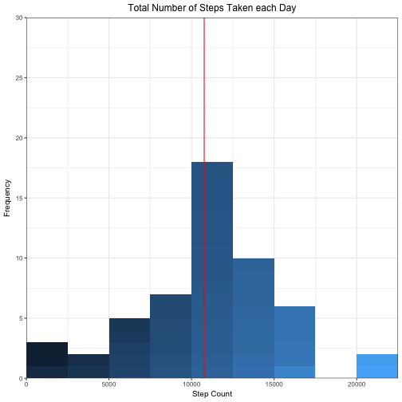
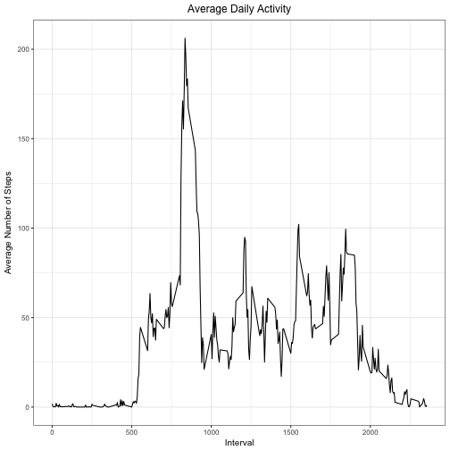
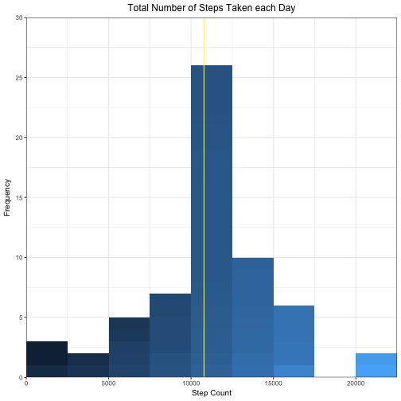
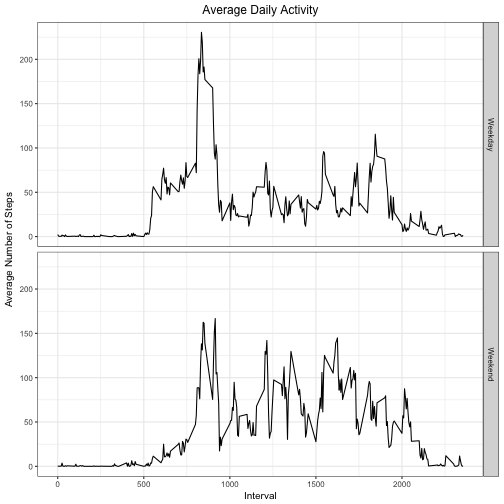

## Loading and preprocessing the data

The first thing we'll do is to load the libraries that will be used during the 
execution of the program, download the data file, and then load the data into R 
in preparation for the analysis. We'll call the fitness data variable fitdata.


```r
library(tidyr)
library(dplyr)
library(ggplot2)

rm(list = ls())
pwd <- getwd()

if (dir.exists("FitData")) {
      unlink("FitData", recursive = TRUE)
}

dir.create("FitData")
setwd("FitData")

fileURL <- 
      "https://d396qusza40orc.cloudfront.net/repdata%2Fdata%2Factivity.zip"
download.file(fileURL, destfile = "FitData.zip",method = "curl")
unzip("FitData.zip")
setwd(pwd)

fitdata <- read.csv("activity.csv", 
                    stringsAsFactors = T, 
                    na.strings = "NA", 
                    colClasses = c("integer","Date","integer"))
```

## What is mean total number of steps taken per day?
In order to answer this question we'll group the fitness data by date, then get 
the total number of steps taken every day. The result of this operation will be 
stored in a new variable named fdata.


```r
fdata <- fitdata %>% 
      group_by(date) %>% 
      summarize(step_count = sum(steps))
```

Let's create a histogram of this data to visually inspect the distribution
of the steps taken each day.

```r
g <- ggplot(fdata, aes(step_count, 
                       fill=step_count, 
                       group=step_count))

g + geom_histogram(binwidth = 2500,boundary=-0.5) +
    ggtitle("Total Number of Steps Taken each Day") +
    labs(x="Step Count", 
         y="Frequency") +
    scale_x_continuous(expand=c(0,0),
                       breaks=seq(0,30000, by=5000)) +
    scale_y_continuous(expand=c(0,0),
                       limits=c(0,30),
                       breaks=seq(0,30, by=5)) +
    theme_bw(base_size = 10) +
    theme(plot.title=element_text(hjust=0.5),legend.position = "none") +
    geom_vline(xintercept=mean(fdata$step_count, na.rm = T), color="red")
```

```
## Warning: Removed 8 rows containing non-finite values (stat_bin).
```



The mean and median values for this data set are as follows:

```r
c(mean=mean(fdata$step_count, na.rm = T),
  median=median(fdata$step_count, na.rm = T))
```

```
##     mean   median 
## 10766.19 10765.00
```

## What is the average daily activity pattern?
What we want to do here is to get the average activity done each interval across
all the days. For this we create a new variable called avgdata that will store
the mean number of steps per interval.


```r
avgdata <- fitdata %>%
      group_by(interval) %>%
      summarize(steps_avg=mean(steps, na.rm=T))
```

Once we have collected the data, we can visually inspect the data to see if there
is any pattern on it.

```r
g <- ggplot(avgdata, 
            aes(x = interval, 
                y = steps_avg))

g + geom_line() + 
      ggtitle("Average Daily Activity") +
      labs(x="Interval", 
           y="Average Number of Steps") +
      theme_bw(base_size = 10) +
      theme(plot.title=element_text(hjust=0.5),legend.position = "none")
```



From this data set, we can identify which interval corresponds to the highest 
mean number of steps value, which for this particular set of data that interval
is 835.

```r
maxavg <- avgdata[which.max(avgdata$steps_avg),]
maxavg
```

```
## # A tibble: 1 × 2
##   interval steps_avg
##      <int>     <dbl>
## 1      835  206.1698
```

## Imputing missing values
The original data set contains NA values, which were ignored during the 
calculation of the mean and median. Instead of ignoring them or making them zero,
let's add the average number of steps for that interval whenever we find any missing
value.

The first thing we're going to do is copy the data into a new data frame called
fitdata2, this way we don't have to reload the original data in case anything 
wrong happens. 

```r
fitdata2 <- fitdata
```

Let's check how many rows are missing the step count.

```r
missval <- is.na(fitdata2$steps)
sum(missval)
```

```
## [1] 2304
```

So we have little more than 2300 rows without data. Let's add the average number 
of steps that correspond to that interval. Because a person cannot do a half step
we'll round up the average steps to the closest integer value with the help of 
the ceiling function.

```r
for (i in 1:nrow(fitdata2)) {
      if (is.na(fitdata2[i,]$steps)) {
            fitdata2[i,]$steps <- 
                  ceiling(avgdata[avgdata$interval==
                                        fitdata2[i,]$interval,]$steps_avg)
      }
}
```

Now that we have populated those missing values, let's inspect the data once more
to see how looks now with the new data. Let's create a new variable called fdata2,
group the values by date, and summarize by the total number of steps.


```r
fdata2 <- fitdata2 %>% 
      group_by(date) %>% 
      summarize(step_count = sum(steps))
```

Let's now create a histogram with the new data. The yellow vertical line is where the mean step
count is found.

```r
g <- ggplot(fdata2, aes(step_count, 
                        fill=step_count, 
                        group=step_count))

g + geom_histogram(binwidth = 2500,boundary=-0.5) +
      ggtitle("Total Number of Steps Taken each Day") +
      labs(x="Step Count", 
           y="Frequency") +
      scale_x_continuous(expand=c(0,0),
                         breaks=seq(0,30000, by=5000)) +
      scale_y_continuous(expand=c(0,0),
                         limits=c(0,30),
                         breaks=seq(0,30, by=5)) +
      theme_bw(base_size = 10) +
      theme(plot.title=element_text(hjust=0.5),legend.position = "none") +
      geom_vline(xintercept=mean(fdata2$step_count, na.rm = T), color="yellow")
```



The mean and median values for this new data set are as follows:

```r
c(mean=mean(fdata2$step_count, na.rm = T),
  median=median(fdata2$step_count, na.rm = T))
```

```
##     mean   median 
## 10784.92 10909.00
```

## Are there differences in activity patterns between weekdays and weekends?
Last but not least. We'll try to identify if there are different patterns during 
workday days compared to weekend days.

Let's again produce a data set that can help us identify these patterns. We'll
use the newly created data set with imputed values.

```r
weekdata <- fitdata2 %>% 
      mutate(weekdata = ifelse(weekdays(date) == "Saturday" | 
                                     weekdays(date) == "Sunday",
                               "Weekend",
                               "Weekday")) %>%
      group_by(interval, weekdata) %>%
      summarise(steps_avg=mean(steps))
```

Let's plot the data. We can see that there is slightly more activity during the 
day on weekends compared to the weekdays.

```r
g <- ggplot(weekdata, 
            aes(x = interval, 
                y = steps_avg))

g + geom_line() + 
      facet_grid(weekdata ~ .) +
      ggtitle("Average Daily Activity") +
      labs(x="Interval", 
           y="Average Number of Steps") +
      theme_bw(base_size = 10) +
      theme(plot.title=element_text(hjust=0.5),legend.position = "none")
```


